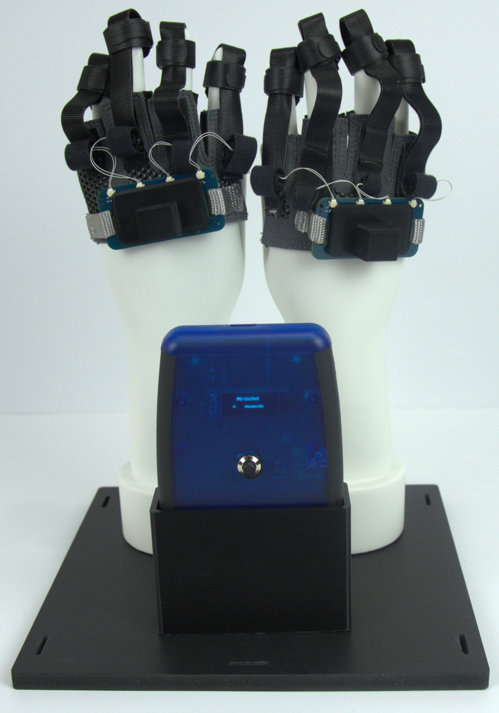
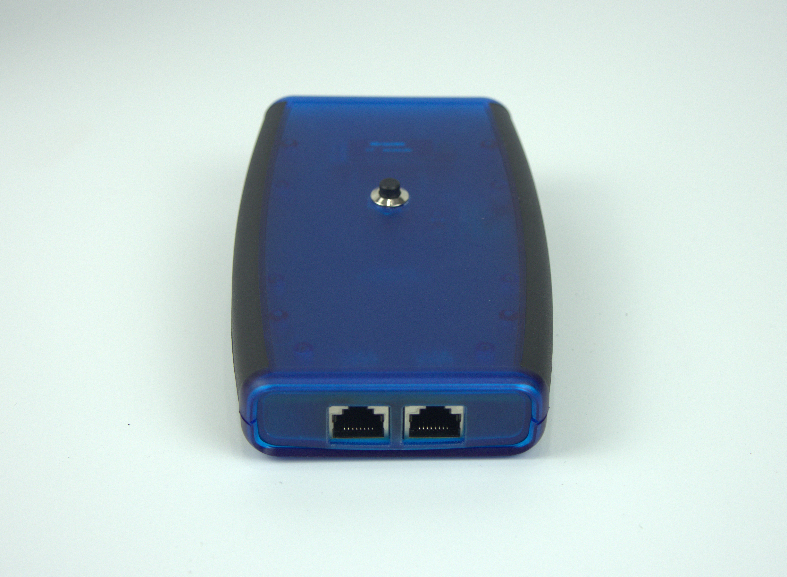
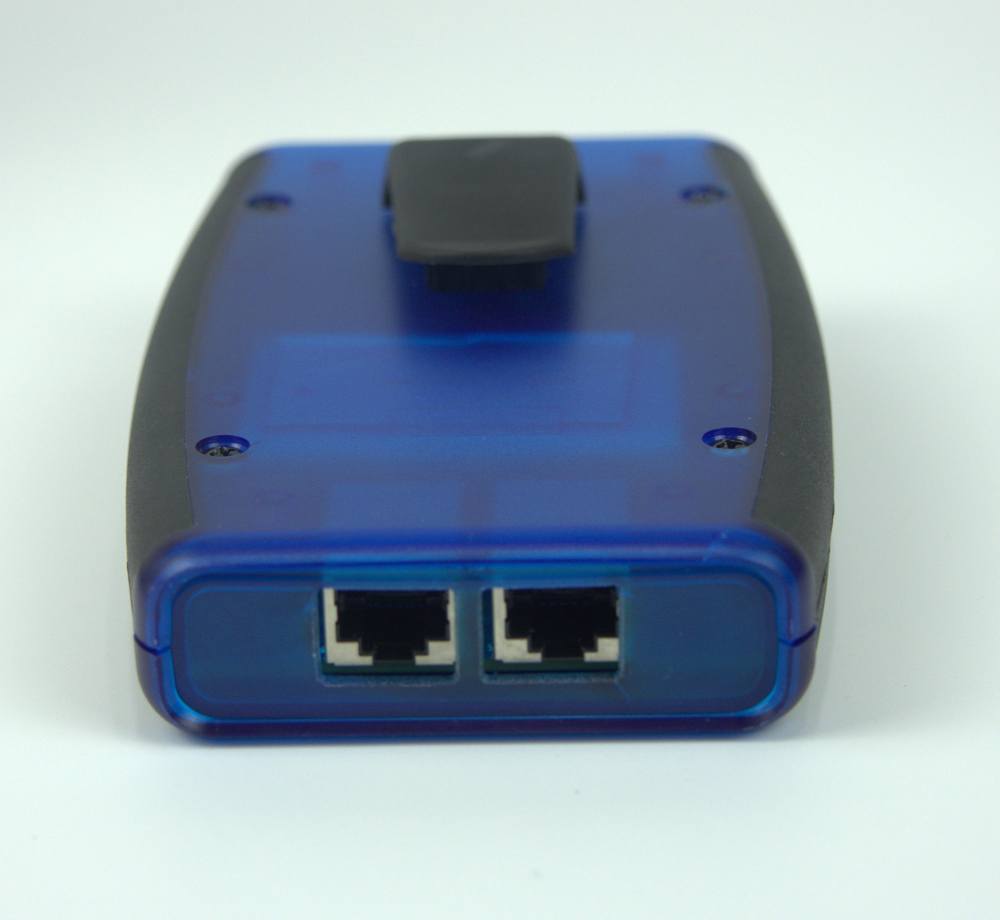

# Parkinsons_Therapy_Glove
Open Source Hardware design for Vibrotactile Coordinated Reset (vCR) Gloves. I'm putting these engineering designs for a wearable device into the world for anyone to use. Use at your own risk!

# Intro

Abnormal synchronization of neuronal activity in dopaminergic circuits is related to motor impairment in Parkinson’s disease (PD). Vibrotactile coordinated reset (vCR) fingertip stimulation aims to counteract excessive synchronization and induce sustained unlearning of pathologic synaptic connectivity and neuronal synchrony.

Vibrotactile Coordinated Reset delivers vibratory stimulation to the fingertips of each hand. A specific pattern of vibration to each fingertip is delivered which theoretically disrupts abnormal synchrony in the brain.

This project provides instructions to build your own vCR Glove. Including Bill of Materials, Instructions, CAD Files, Circuit Board design files, and Firmware.

# Control Box

## Build Steps
1) You will need to have a manufacturer create the Printed Circuit Boards (PCB). Upload the Gerber file to the manufacturer: Control_Box\Electronics\Control_Box_Gerber.zip.  I recommend having your circuit board assembled with all the components. Use the PickAndPlace, and BOM files for assembly. JLCPCB.com is a good choice for manufacturer.
2) You will also need to order parts. See the Bill of Materials.
3) You will need to solder on the Feather Microcontroller, Screen, and Boost Converter. These parts are easy to solder 2.54 through hole components.
4) You will need to solder on the switch to the two pins labeled EN+ and EN-.
5) You will need to cut a hole for the switch, and cut a slot for the USB charging cable. These cuts may be made with hand tools. You may also find laser cutter dxf files in Control_Box/Case_Assembly.
6) You will need to flash the provided firmware onto the Feather Microcontroller. Use the Arduino IDE and a USB cable. See Firmware.

## Hardware Bill of Materials
|Part|Part #|Quantity|Manufacturer|URL|
|----|----|----|----|----|
|Custom Printed Circuit Board (See Control_Box/Electronics for design files) ||1|JLCPCB|https://jlcpcb.com/|
|Panel Mount Latching Push Button|CYT1091|1|Cylewet|https://www.amazon.com/Cylewet-Self-Locking-Latching-Button-CYT1091/dp/B075VBV4QH/ref=sr_1_3?keywords=Latching+Switch&qid=1673285409&sr=8-3|
|Case|1553D|1|Hammond Manufacturing|https://www.digikey.com/en/products/detail/hammond-manufacturing/1553DTBUBK/2094890|
|Belt Clip|1599CLIP|1|Hammond Manufacturing|https://www.digikey.com/en/products/detail/hammond-manufacturing/1599CLIP/460760|
|Boost Converter|U3V40F5|1|Pololu|https://www.pololu.com/product/4012|
|0.91 inch OLED LCD Display 128x32|SSD1306|1|Teyleten|https://www.amazon.com/Teyleten-Robot-Display-SSD1306-Raspberry/dp/B08ZY4YBHL/ref=asc_df_B08ZY4YBHL/?tag=hyprod-20&linkCode=df0&hvadid=647248209079&hvpos=&hvnetw=g&hvrand=3522876089040420258&hvpone=&hvptwo=&hvqmt=&hvdev=c&hvdvcmdl=&hvlocint=&hvlocphy=9010937&hvtargid=pla-1597285851745&psc=1&region_id=972485&gclid=CjwKCAiArY2fBhB9EiwAWqHK6iJZr7Km3gjcYjdACghR9q-pTSBiGfFTmBRAXwzSj8zmCsqIJq6RdxoCsYEQAvD_BwE
|Arduino based Feather Microcontroller|2772|1|Adafruit|https://www.adafruit.com/product/2772|
|Battery|2011|1|Adafruit|https://www.adafruit.com/product/2011|
|Double Sided Adhesive|||||

Note: the battery is necessary for operation.

# Glove Hardware

## Build Steps
1) You will need to send the Printed Circuit Board (PCB) design files to a manufacturer. I recommend having your circuit board assembled with all the components. Upload the Gerber file to the manufacturer (Glove_Hardware/Electronics/Glove_Gerber.zip).
2) Create cables by soldering or crimping the JST Cables onto the ERM Vibration Motor cables. You will need to make eight cable/motor assemblies.
3) Create the motor/finger mounts. This uses double sided velcro stips. The ERM Vibration Motor and cable is placed between two strips, and sewed at the ends. A third piece of velcro strip is used around the finger to ensure a snug fit. You will need to make 8 motor/finger mounts.
4) Cut and attach velcro strips to the glove so that they align with each finger on the glove. Recommend sewing the velcro strips to the gloves, and using adhesive.
5) Leaving extra length for hand movements. Using 1/2-inch Paracord, sew the circuit board to the gloves.
6) Plug the cable assemblies into to the circuit board.
7) Plug an ethernet cable between the glove and control box.
8) Optional. You can 3D print covers for the circuit boards. See Glove_Hardware/glove_PCB_cover.stl.

## Bill of Material

|Part|Part #|Quantity|Manufacturer|URL|
|----|----|----|----|----|
|Custom Printed Circuit Board (See Control_Box/Electronics) ||2|JLCPCB|https://jlcpcb.com/|
|ERM Vibration Motor|1637|8|Pololu|https://www.pololu.com/product-info-merged/1637|
|JST Cables|A02SUR02SUR32W152A|8|JST|https://www.digikey.com/en/products/detail/jst-sales-america-inc/A02SUR02SUR32W152A/6009353|
|Fingerless gloves|F019-BK-M|1|Fit Four|https://www.amazon.com/dp/B06X6NCYP1?psc=1&ref=ppx_yo2ov_dt_b_product_details|
|1/2-inch Paracord|10 X FLTNYLWEB12-SILVER|1|PARACORD PLANET|https://www.amazon.com/dp/B08DZ5GG8W?psc=1&ref=ppx_yo2ov_dt_b_product_details|
|Velcro Strips|91140|1|Velcro Brand|https://www.amazon.com/dp/B001E1Y5O6?psc=1&ref=ppx_yo2ov_dt_b_product_details|
|Ethernet Cable| |2|UGREEN|https://www.amazon.com/dp/B0875NB89J?psc=1&ref=ppx_yo2ov_dt_b_product_details|
|Thread for Sewing| |1|Generic| |
|Adhesive| |1|Generic| |

# Display Case (optional)

## Build Steps
1) Assemble the case using the provided components.
2) Mount the Mannequin Hand Display Stands to the board. I used two screws in each hand.
3) There is a stand for the Control Box which can be 3D printed. See Display_Case_Hardware\control_box_holder.stl. I used three screws to mount the control box holder.

## Bill of Materials

|Part|Part #|Quantity|Manufacturer|URL|
|----|----|----|----|----|
|Mannequin Hand Display Stands| |1|Taotenish|https://www.amazon.com/dp/B07YR2G1NX?psc=1&ref=ppx_yo2ov_dt_b_product_details|
|Display Case|8x8x12 inch 20x20x30 cm|1|KOLIPI|https://www.amazon.com/dp/B0B3WMXPKL?ref=ppx_yo2ov_dt_b_product_details&th=1|

# Editors
You may edit the Electronic design files using a PCB editing software called easyEDA. This project can be accessed on EasyEDA at: https://pro.easyeda.com/editor#id=4203400eb7db434e9a89eb5de0ddfd4a

# Attribution

The construction of this project would not be possible without the hard work and dedication of the research team that created Vibrotactile coordinated reset (vCR), conducted the research, and generally worked on this endeavor.

# Author

* Jason Hejna - Product Development Engineer

# Final Thoughts

All design files are provided completely free of charge. I welcome any feedback or improvements to the design. Please submit feedback through Github.

Please notify me if parts go out of stock. I would like to update out of stock parts.

To anyone who tries this design. Please let me know how it goes!

Thank you

# License
This source code is licensed under the Apache-2.0 license found in the LICENSE file in the root directory of this source tree.

This project should be considered Open Source Hardware. You are free to use and modify any of the content herein. Use at your own risk!

This source code is licensed under the Apache-2.0 license found in the LICENSE file in the root directory of this source tree. This project should be considered Open Source Hardware. You are free to use and modify any of the content herein.

Unless otherwise separately undertaken by the Licensor, to the extent possible, the Licensor offers the Licensed Material as-is and as-available, and makes no representations or warranties of any kind concerning the Licensed Material, whether express, implied, statutory, or other. This includes, without limitation, warranties of title, merchantability, fitness for a particular purpose, non-infringement, absence of latent or other defects, accuracy, or the presence or absence of errors, whether or not known or discoverable. Where disclaimers of warranties are not allowed in full or in part, this disclaimer may not apply to You.

To the extent possible, in no event will the Licensor be liable to You on any legal theory (including, without limitation, negligence) or otherwise for any direct, special, indirect, incidental, consequential, punitive, exemplary, or other losses, costs, expenses, or damages arising out of this Public License or use of the Licensed Material, even if the Licensor has been advised of the possibility of such losses, costs, expenses, or damages. Where a limitation of liability is not allowed in full or in part, this limitation may not apply to You.

The disclaimer of warranties and limitation of liability provided above shall be interpreted in a manner that, to the extent possible, most closely approximates an absolute disclaimer and waiver of all liability.

